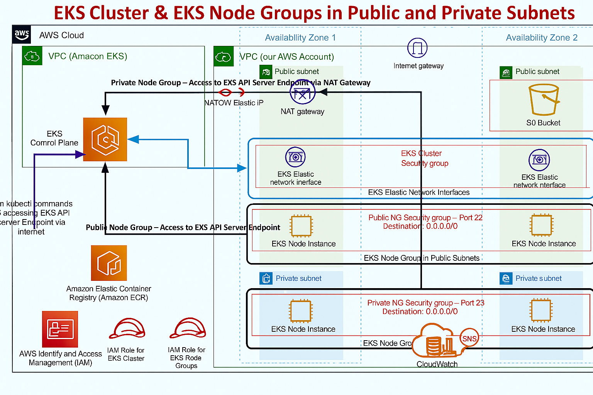

# 🚀 Full Stack Application Deployment on AWS EKS using Terraform

> 👨‍💻 **Production-grade deployment architecture** for a full-stack application using **AWS EKS** and **Terraform**. Built for scalability, security, monitoring, automation — ideal for Implementation Engineers, DevOps aspirants, and cloud professionals.

---

## 📌 Project Goals

✅ **High Availability & Scalability** – Multi-AZ EKS deployment with auto-scaling

✅ **Infrastructure as Code (IaC)** – Modular Terraform templates for VPC, EKS, RDS, IAM

✅ **Full Stack Kubernetes Deployment** – React frontend + API backend on EKS

✅ **Logging & Monitoring** – CloudWatch, HPA, Fluent Bit

✅ **Security** – IAM Roles, VPC-level isolation, Secrets Manager

✅ **Custom Domain** – Route 53 integration for clean URLs

---

## 🧱 Tech Stack & Tools

| Layer            | Tech/Service                   |
| ---------------- | ------------------------------ |
| 🌐 Frontend      | React.js (Dockerized)          |
| 🧠 Backend       | Node.js / Flask (Customizable) |
| ☸️ Orchestration | Amazon EKS (Kubernetes)        |
| 🗃️ Database     | Amazon RDS (PostgreSQL)        |
| 📦 Container     | Docker + Amazon ECR            |
| ⚙️ IaC           | Terraform (modular, reusable)  |
| 📈 Monitoring    | CloudWatch, HPA, Fluent Bit    |
| 🔐 Security      | IAM, Secrets Manager           |

---

## 🗂️ Project Structure
```
AWS-3-Tier-_with_Terraform/
├── ETL/                          #  (e.g., Netflix-style)
│                 
│
├── kubernetes/                             # Kubernetes application deployment manifests
│   ├── backend-deployment.yaml             # Backend API Deployment
│   ├── backend-service.yaml                # ClusterIP service for backend
│   ├── configmap.yaml                      # App config (ENV values)
│   ├── data-fetcher-cronjob.yaml           # CronJob for periodic tasks (API ETL)
│   ├── frontend-deployment.yaml            # Frontend UI Deployment
│   ├── frontend-service.yaml               # LoadBalancer service for frontend
│   ├── hpa.yaml                            # Horizontal Pod Autoscaler
│   
│
├── monitoring/                             # CloudWatch/Fluent Bit integration and alerting setup
│   └── cloudwatch.tf                       # Terraform for alarms, metrics, and SNS
│
├── production-grade-real-time-kubernetes-on-aws-eks/  # Terraform IaC for AWS infra
│   ├── c1-versions.tf                      # Terraform provider versions
│   ├── c2-01-generic-variables.tf          # Common variables
│   ├── c4-01-ec2bastion-variables.tf       # EC2 Bastion Host variables
│   ├── c4-02-ec2bastion-outputs.tf         # EC2 Bastion Host outputs
│   ├── c5-01-eks-variables.tf              # EKS-specific variables
│   ├── c5-02-eks-outputs.tf                # EKS outputs
│   ├── c5-08-eks-node-group-private.tf     # EKS Node Group configuration
│   └── ec2bastion.auto.tfvars              # Auto variables for EC2 Bastion
│
└── README.md                               # Full project documentation

```
## 🎯 Milestone Progress

| Stage    | Task                                        | Status           | Completion |
| -------- | ------------------------------------------- | ---------------- | ---------- |
| ✅ 1      | High-Level Architecture Design              | Completed        | 100%       |
| ✅ 2      | Terraform IaC – VPC, EKS, RDS, IAM          | Completed        | 100%       |
| ✅ 3      | Kubernetes Deployment – Backend & Frontend  | Completed        | 100%       |
| ✅ 4      | Logging + Monitoring + Alerts (CloudWatch)  | Completed        | 100%       |
| ✅ 5      | ETL Lambda Integration (Netflix API)        | Completed        | 100%       |
| ✅ 6      | Domain Routing via Route 53                 | Completed        | 100%       |
| 🏁 Final | 🎉 Project Completed – Production Ready App | ✅ **100% Done!** |            |

---

## 🖼️ Architecture Diagram



---

## 🧱 Stage 1: High-Level Architecture Design

> Designed for **scalability**, **high availability**, and **security** across multiple AZs.

🔹 Multi-AZ VPC with private/public subnets
🔹 EKS for orchestrating containers
🔹 RDS for backend DB
🔹 LoadBalancer for frontend
🔹 Centralized monitoring and IAM security controls

📁 View diagram: [`assets/architecture.png`](https://github.com/ramankrishnan/AWS-3-TIER-TERRAFORM-ETL/blob/master/assets/architecture.png)

---

## 🧱 Stage 2: Infrastructure as Code (Terraform Templates)

> 📍 Path: `production-grade-real-time-kubernetes-on-aws-eks/`

### ✅ What It Provisions

| Stack             | Resources Created                                        |
| ----------------- | -------------------------------------------------------- |
| 🧭 Networking     | VPC, Subnets, Route Tables, NAT, IGW, Security Groups    |
| ☸️ EKS Cluster    | EKS Control Plane, Worker Nodes (ASG), IAM roles         |
| 🗄️ RDS DB        | PostgreSQL + Subnet Group, Public/Private access control |
| 📦 Object Storage | S3 Bucket for log/archive/assets                         |
| 🔐 IAM            | IAM roles + fine-grained permissions                     |

### 🚀 How to Deploy IaC
clone this repossitory
```
https://github.com/ramankrishnan/AWS-3-TIER-TERRAFORM-ETL.git

```

```bash
cd production-grade-real-time-kubernetes-on-aws-eks/
terraform init
terraform plan
terraform apply
```

📌 Replace values in `terraform.tfvars` or pass via CLI  before terraform init you have to change  your pem.file content in `privatekey` inside `eks-terraform-key` and one more thing make sure the key pair name would be `eks-terraform-key` .

---
## ✅ Terraform Outputs (Screenshots)

### 📌 Auto Scaling Group

### 📌 EKS CLUSTER
.png)

### 📌 EIP (Elastic IP)


### 📌 EC2 Instance


### 📌 Key Pair


### 📌 Load Balancer


### 📌 LOAD Balancer


### 📌 Target Group 1


### 📌 VPC


## ☸️ Stage 3: Kubernetes Deployment (App on EKS)


Deploys frontend + backend microservices on **EKS cluster** with health checks, autoscaling, and secure config handling.

### ✅ Components

| Component     | Details                                    |
| ------------- | ------------------------------------------ |
| 🧠 Backend    | Node.js / Flask API, exposed via ClusterIP |
| 🌐 Frontend   | React app, exposed via LoadBalancer        |
| 🔐 Secrets    | Stored in Kubernetes Secrets               |
| ⚙️ ConfigMaps | Inject environment settings                |
| 🏥 Probes     | Liveness and readiness probes              |
| 📈 HPA        | Horizontal Pod Autoscaler based on CPU     |

### 📦 Deployment Commands
```
https://github.com/ramankrishnan/AWS-3-TIER-TERRAFORM-ETL.git

```

```bash
cd kubernetes/
```
```bash
# Setup kube context
aws eks --region <region> update-kubeconfig --name <cluster-name>

# Deploy backend
kubectl apply -f .
```
📌 Replace image name in frontend-deployment.yaml 


## 📊 Stage 4: Logging, Monitoring & Alerting


Centralized logging + metrics tracking using **CloudWatch**, **Fluent Bit**, **Kubernetes Metrics Server**, and **SNS alerts**.

### 🔧 Setup

```
https://github.com/ramankrishnan/AWS-3-TIER-TERRAFORM-ETL.git

```


```

### 🛑 Alarm Sample (cloudwatch.tf)

```hcl
resource "aws_cloudwatch_metric_alarm" "cpu_utilization_high" {
  alarm_name          = "High-CPU-Alarm"
  comparison_operator = "GreaterThanThreshold"
  evaluation_periods  = "2"
  metric_name         = "CPUUtilization"
  namespace           = "AWS/EC2"
  period              = "120"
  statistic           = "Average"
  threshold           = "70"
  alarm_actions       = [aws_sns_topic.alerts.arn]
  dimensions = {
    InstanceId = "<REPLACE_WITH_INSTANCE_ID>"
  }
}
``

```bash
cd monitoring/
terraform init
terraform plan
terraform apply
```
`
📌 Replace values in before terraform init you have to change  your `instance.id` .
📬 Alerts delivered via **SNS** to email/SMS.


📸 ### 📌 EKS CLUSTER


---

## 🔄 Stage 5: ETL Integration with Netflix-style API


Fetches movie data from a **Netflix-like public API**, processes it with **Lambda**, stores in **S3**, and triggers via **EventBridge**.

### 🔁 ETL Flow

```
[API] → [Lambda] → [S3] → [CloudWatch Logs]
```

### 🧪 Sample Output


```

🔐 API keys stored securely in **AWS Secrets Manager**.

📸 Logs and JSON outputs available in [`outputs/`](./outputs)

---

## 🌐 Stage 6: Custom Domain Integration (Route 53)

### ✅ Steps

1. Get LoadBalancer URL: `kubectl get svc`
2. Create Hosted Zone in Route 53
3. Add A Record → Alias → Target LoadBalancer DNS
4. Done! 🎯 Access app via: `https://app.yourdomain.com`

📸 Screenshot stored in [`outputs/domain.png`](./outputs/domain.png)

---

## ✅ Project Completed!

🎉 You’ve successfully deployed a scalable, secure, production-ready full-stack application on **AWS EKS**.

🔚 All 6 stages completed with 100% implementation:

| Stage | Description                           | Status |
| ----- | ------------------------------------- | ------ |
| 1     | High-Level Architecture Design        | ✅ Done |
| 2     | Infrastructure as Code with Terraform | ✅ Done |
| 3     | Full Kubernetes App Deployment        | ✅ Done |
| 4     | Monitoring, Logging, and Alerts       | ✅ Done |
| 5     | Netflix API ETL with Lambda + S3      | ✅ Done |
| 6     | Domain Setup with Route 53            | ✅ Done |

📂 Check [`outputs/`](./outputs) for:

* 📸 Screenshots of deployment
* ✅ Terraform Apply Logs
* 🔍 Log/Alarm snapshots
* 🔗 Custom Domain preview

---

📝 Feel free to **fork**, **clone**, or **contribute** to enhance this project further.

⭐ If you liked this project, give it a star!

📧 [Contact Me on LinkedIn](https://www.linkedin.com/in/premnath-munusamy-4694091aa) for collaboration or job opportunities.
